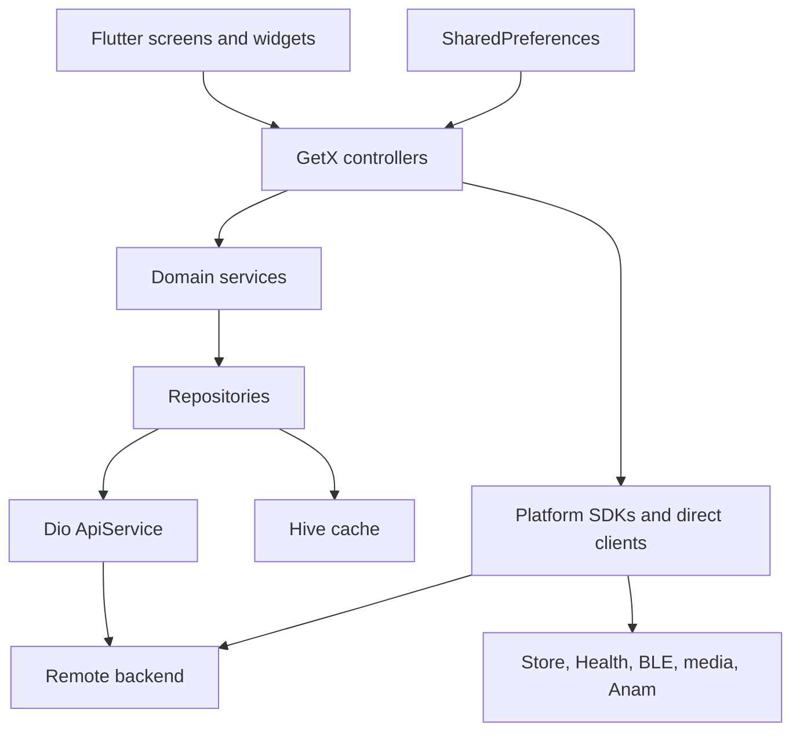
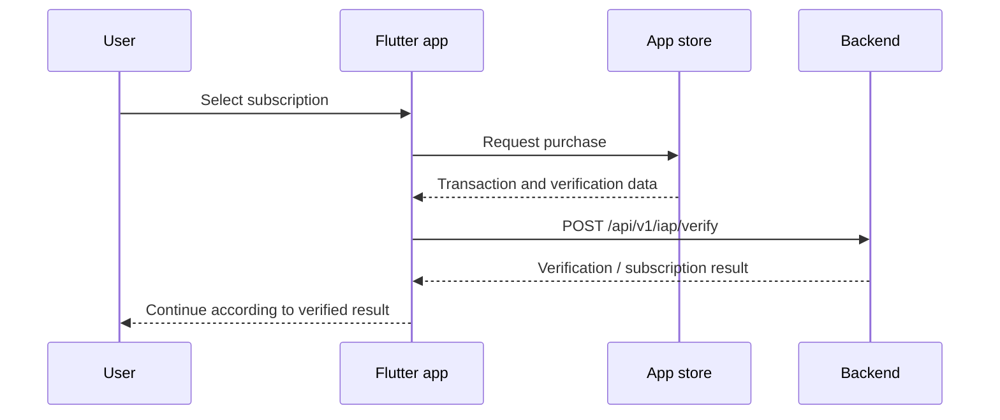

# P2P FitTech AI — Complete Project Guide

Future gym builders: preserve the shared home logo placement and follow the
[home branding contract](docs/enterprise/HOME_BRANDING.md) when configuring gyms.

> Repository walkthrough prepared on 7 September 2026, against commit `55f4bb4`.
> This guide describes the checked-in source code. The app was not launched, live services were not contacted, and purchases, device connections, and backend deployments were not tested for this documentation review. “Implemented” means implementation exists in this checkout; it does not certify production availability.

## Contents

1. [Project at a glance](#1-project-at-a-glance)
2. [Who the app serves](#2-who-the-app-serves)
3. [First launch and account journey](#3-first-launch-and-account-journey)
4. [Fitness user walkthrough](#4-fitness-user-walkthrough)
5. [Trainer walkthrough](#5-trainer-walkthrough)
6. [Admin, affiliate, and gym experiences](#6-admin-affiliate-and-gym-experiences)
7. [Feature implementation status](#7-feature-implementation-status)
8. [Architecture and startup](#8-architecture-and-startup)
9. [Repository structure](#9-repository-structure)
10. [Data and API contracts](#10-data-and-api-contracts)
11. [AI, video, and messaging](#11-ai-video-and-messaging)
12. [Subscriptions and payments](#12-subscriptions-and-payments)
13. [Devices and permissions](#13-devices-and-permissions)
14. [Design and shared components](#14-design-and-shared-components)
15. [Local setup and running the app](#15-local-setup-and-running-the-app)
16. [Build and release workflow](#16-build-and-release-workflow)
17. [Tests and verification](#17-tests-and-verification)
18. [Known limitations and maintenance priorities](#18-known-limitations-and-maintenance-priorities)
19. [Practical demonstration script](#19-practical-demonstration-script)
20. [Developer starting points](#20-developer-starting-points)
21. [Reference inventories](#21-reference-inventories)

## 1. Project at a glance

P2P FitTech AI is a Flutter mobile fitness platform combining personalized workout generation, trainer-client management, video content, AI avatar conversations, subscription access, and activity tracking. It also includes platform administration, affiliate reporting, and a gym-specific branded experience.

The central product journey is: create an account, complete a fitness profile, generate or receive a workout, follow the exercise instructions, record completion, and review progress. Trainers support that journey through client management, exercise libraries, meal/workout assignments, and content publishing.

| Item | Current repository value |
|---|---|
| Product name used by the current branding service | P2P FitTech AI |
| Dart package name | `pler_to_pler_app` |
| App version | `4.11.0+3088` |
| Flutter version pinned by FVM | `3.41.4` |
| Dart SDK constraint | `^3.10.4` |
| Main targets present | iOS and Android |
| iOS bundle / Android application ID | `com.p2pfittech.ai` |
| Main application entry point | `lib/main.dart` |
| State, routing, dependency management | GetX |
| Primary modern HTTP layer | Dio through `ApiService` |
| Additional HTTP layer | `http` through `ApiClient`, plus direct clients |
| Local persistence | Hive and SharedPreferences |
| CI configuration | Codemagic iOS release workflow |
| Embedded package | Local Anam Flutter SDK |
| Backend material | Partial TypeScript/Express source under `artifacts/` and `src/` |

The existing [README](README.md) contains historical information: its app name, version, startup architecture, design dimensions, and several feature descriptions differ from the current implementation. This guide uses the source code as the deciding reference.

## 2. Who the app serves

| Audience / mode | Main purpose | Navigation in the current code |
|---|---|---|
| Fitness user | Workouts, progress, gym discovery, content, trainer access | Home, History, Gyms, Contents, Trainer |
| Trainer | Manage clients, requests, plans, and content | Home, Clients, Gyms, Contents, Request, Messages |
| Platform admin | Platform metrics, user administration, withdrawals | Home, Clients, Contents, Request, Admin |
| Affiliate | Referral and earnings reporting | User tabs plus Earnings |
| Gym tenant | Branded fitness experience | Tenant branding and a dedicated KMF admin path |

These are application experiences, not necessarily five independent backend role values. Admin and affiliate services influence the navigation mode; tenant identity is a separate scope. The admin can switch to a user preview, and the navigation controller preserves separate admin and user tab positions.

**Navigation source:** [nav_item_model.dart](lib/features/bottom_nav_bar/data/models/nav_item_model.dart). Its actual admin tab list excludes Gyms and Messages, despite a nearby comment describing admin navigation as fully additive.

## 3. First launch and account journey

### 3.1 Startup and consent

1. The application initializes services and displays its animated splash screen.
2. The splash controller reads the `privacyAccepted` preference.
3. If consent has not been saved, it opens the privacy and terms acceptance screen before continuing.
4. Without an authenticated session, it sends the user into onboarding.
5. Onboarding advances through introductory pages. Completing or skipping it leads into the Smarter Care selection experience.
6. Smarter Care offers Fitness and Clinical. Fitness leads to login; Clinical is explicitly marked Coming Soon.

The older Fitness/Facility descriptions in the README should not be treated as the authoritative current entry flow.

### 3.2 Registration and sign-in

The authentication module includes registration, email/password login, OTP verification, resend/recovery paths, password reset, and password changes. Registration sends personal details and can include referral and tenant information. The login UI supports User and Trainer selection, while the returned account information drives session handling.

Google sign-in and Firebase authentication dependencies and configuration code also exist. Their presence does not establish that every platform’s provider configuration has been validated.

The login controller offers **Save Login**. At a later startup, the splash flow checks `sessionPersisted`; when persistence was not selected, it logs out rather than silently restoring the session.

### 3.3 Profile completion and landing screen

`ProfileService.resolveInitialRoute()` fetches or restores profile data and checks onboarding completion:

- Incomplete user profile → user profile completion screen.
- Incomplete non-user profile → trainer profile completion screen.
- Completed profile → main navigation shell.
- Profile fetch failure without usable cached profile → login.

Although this method accepts an `isSubscribed` parameter, the current method does not use it to enforce a global paywall. Subscription flows have their own entry points and checks.

### 3.4 Session, role, and tenant restoration

The app restores supported gym branding from cached backend-issued tenant scope. The splash controller also contains owner-account admin-mode restoration logic. Client-side role checks determine the visible experience; privileged requests still require backend authorization.

**Main sources:** [splash controller](lib/features/splash/controllers/splash_controller.dart), [login controller](lib/features/authentication/presentation/controllers/login_controller.dart), [profile service](lib/features/profile/domain/services/profile_service.dart).

## 4. Fitness user walkthrough

### 4.1 Home dashboard

The subscriber home is the daily starting point. Its implementation brings together calendar/date selection, workout information, workout generation controls, progress-related information, achievements access, and nearby gym entry points. The home screen is assembled from the user dashboard controller and dedicated workout and achievement components.

Some values depend on successful API responses. A populated dashboard should not be assumed for a new account with no workout history.

### 4.2 Create an AI workout

The current workout controller provides a five-page form and records:

- Fitness goals.
- Focus areas.
- Training environments.
- Available equipment.
- Intensity choices and session duration.

The client creates a workout record and requests generation. A generating screen communicates the wait, and the result is parsed into a structured workout plan.

The AI plan model supports a coach note, weekly focus, nutrition tip, warm-up, main work, accessories, finisher, cooldown, estimated duration, cardio guidance, suggested video, and a check-in question. It can also carry trainer persona and specialty information.

Each exercise can contain sets, repetitions, rest time, RPE, ordered instructions, substitutions, muscle group, and completion state. RPE is the model’s field for perceived effort.

### 4.3 Follow and complete a workout

The workout workflow supports opening plan details, starting a session, marking individual exercises complete, and completing the session. The controller distinguishes `in_progress` and `completed` states and includes actual-duration and check-in response inputs.

Completion data is sent to the backend rather than being only a visual checkbox. The client also has access to a today overview and monthly progression records.

**Main implementation:** [workout controller](lib/features/user/workout/presentation/controllers/workout_controller.dart), [workout models](lib/features/user/workout/data/models/workout_model.dart), [workout repository](lib/features/user/workout/data/repositories/workout_repository.dart).

### 4.4 History and achievements

History gives the user a place to revisit recorded activity. Separate progression models represent monthly statistics. Achievements have a dedicated screen and service, with API calls for retrieving achievements and recording whether an achievement has been presented or shared.

The data model and endpoints support celebration and sharing flows; actual awards depend on backend records and rules.

### 4.5 Trainer discovery and subscriptions

The Trainer experience connects the user to trainer discovery, trainer profiles, matching, and subscription selection. The `subscribe` module contains the active discovery and payment-related screens, alongside older similarly named screens elsewhere in the tree.

The app includes both self-guided continuation and paid trainer selection paths. Store product availability, backend verification, and the account’s state affect what becomes available.

### 4.6 Contents and video playback

The Contents tab provides a media feed with category, detail, and video-player flows. The repository includes reel-specific controllers as well as players managed by the shared video playback manager.

Playback ownership is a significant part of the implementation: switching tabs pauses or stops relevant players, and route observation coordinates playback when moving to details or other screens. This matters because the navigation shell keeps tab widgets alive.

### 4.7 Gyms

The Gyms screen starts with `EnterpriseGymModel.partners`, a local partner directory. It offers text search, activity filters, location-based sorting, and a Near Me action that opens a maps search.

The filters include HIIT, Yoga, Pilates, Boxing, Cycling, and Strength. The local directory and external map search should be distinguished from a server-maintained live gym inventory.

### 4.8 Device management

Users can manage devices, add/pair a supported device, and view device details and metrics. Apple Watch data is read through Apple Health on iPhone; the supported Bluetooth watch types use BLE paths. See [Devices and permissions](#13-devices-and-permissions) for exact scope.

### 4.9 Community and body-progress features

The Before/After screen lets the user select two gallery images, add a caption, and upload multipart data to `/api/v1/user-posts`. The controller validates that both images are present and reports upload success or failure.

**Rate My Peel / Fitness Check-In is a separate Coming Soon feature.** It should not be described as a working body-analysis service just because its banner and screen exist.

### 4.10 Profile, settings, and account actions

The project contains personal and fitness profile editing, profile and cover-photo uploads, password changes, privacy/legal screens, notification lists, invoice views, PDF previews, earnings-related screens, and account-deletion API support. Some settings options are role-specific.

The in-app notification list is separate from remote push delivery. The former has repositories and API routes; the latter currently initializes through a no-op service.

## 5. Trainer walkthrough

### 5.1 Trainer dashboard

The current trainer home displays metrics including Active Clients, New Clients (7 Days), This Week, Meals Assigned, and Workouts Assigned. Its assignment controls allow a trainer to choose an active client and open a workout or meal-plan creation screen.

Older schedule/calendar modules remain in the repository, but the current primary dashboard should be understood from its live tab mapping and screen implementation.

### 5.2 Clients and requests

Trainers can browse clients and open client details. Trainer requests have list and detail screens with fitness-profile information, and the API constants include accept/action endpoints for requests.

These flows depend on the logged-in trainer’s backend records. Empty client and request lists are valid account states.

### 5.3 Exercise library and blocks

The exercise-block feature organizes reusable training material. It includes screens for:

- Browsing blocks and inspecting block details.
- Creating a block manually or requesting AI generation.
- Adding exercises.
- Adding ordered exercise instructions.
- Adding exercise substitutions.

The endpoints are scoped around a trainer ID, with an `approvedOnly` option on block lists. This library is distinct from an individual user’s generated workout session.

### 5.4 Workout and meal assignments

The trainer can create an exercise plan or a meal plan for a selected client. The meal creation implementation posts a typed plan payload through the shared trainer workout-plan endpoint; this is worth remembering when tracing backend contracts, since the endpoint name alone does not describe every supported plan type.

Assigned-plan and schedule modules also exist. Their presence should not be taken to mean every historical screen is reachable from the current navigation.

### 5.5 Content and trainer AI configuration

Trainer content tools include categories, content creation, and media details. The trainer floating action menu exposes content-category and photo/video publishing actions.

The AI module contains instruction and training screens backed by trainer knowledge-pack functionality. Anam configuration has its own trainer-scoped endpoints and connection screens.

### 5.6 Earnings and invoices

Trainer earnings, payment history, withdrawal requests, invoices, and PDF invoice previews have dedicated code. Admins have separate withdrawal review actions. Amounts and payment states are supplied by the backend.

### 5.7 Messaging limitation

The current trainer Messages tab opens `TrainerInboxScreen`, which displays **Messaging coming soon**. The codebase also contains older client chat, Socket.IO support, a trainer messaging HTTP service, and a partial Stream Chat wrapper.

Those lower-level pieces do not make the visible trainer inbox a completed messaging product.

## 6. Admin, affiliate, and gym experiences

### 6.1 Platform administration

The admin controller supports platform metrics such as total users, signup counts, verified/unverified users, active subscriptions, role/tier breakdowns, and recent users. User management includes verification, role changes, suspension, and access grants. Withdrawal requests can be reviewed, approved, or rejected.

The included backend admin routes apply `guardRole(["admin"])` to privileged operations. The full deployed authorization behavior cannot be established from this partial checkout alone.

The owner-facing user preview changes tabs and actions to the subscriber experience. It is a UI mode, not a replacement for backend permission enforcement.

### 6.2 Affiliates

The affiliate dashboard loads dashboard statistics and referrals and can submit a withdrawal request. Its data includes referral-code and revenue-share information. Affiliate mode adds an Earnings tab to the user navigation.

### 6.3 Gym branding and KMF

`TenantBrandService` currently defines KMF Fitness, including its logo, green primary color, tagline, background, and dedicated admin-experience identifier.

Brand activation is based on cached backend-issued tenant scope. It is not inferred simply from an email address or a selected gym preview. The KMF admin screen requests `/gym-admin/kmf-fitness/dashboard` through the `ApiUrls` configuration path.

Gym preview screens and the static partner directory provide additional entry points; they do not establish that every listed gym has a fully provisioned tenant backend.

## 7. Feature implementation status

| Area | Evidence in this checkout | Qualification |
|---|---|---|
| Email authentication and profile completion | Controllers, repositories, routes | Requires functioning auth backend and delivery services for OTP flows |
| AI workout creation and tracking | Forms, models, repository calls, session state | Requires generation and progression endpoints |
| Trainer clients and requests | Lists, detail screens, request APIs | Requires trainer-scoped records |
| Trainer workout/meal assignments | Client selection and creation screens | Backend must accept the matching payloads |
| Exercise block management | Manual/generation/detail screens | Backend approval and ownership rules apply |
| Video feed | Feed, detail, player, lifecycle components | Requires available media and feed services |
| AI avatar calls | Anam controllers, session APIs, local SDK | Requires working provider and backend session setup |
| Purchases and restore | Store integration and verification clients | Store configuration and backend validation are external requirements |
| Gym discovery | Static directory, filters, geolocation, map launch | Directory is not a verified live inventory |
| KMF branding/admin | Tenant service and dashboard screen | Requires backend tenant scope and dashboard API |
| Device pairing and metrics | BLE, Apple Health, backend sync code | Physical-device compatibility was not tested |
| Achievements | Screen, data service, presentation/share endpoints | Award logic depends on backend |
| Before/after uploads | Picker and multipart submit controller | Requires media upload and publishing backend |
| Admin and affiliates | Dashboard controllers and actions | Requires server-side authorization and data |
| In-app notifications | Notification module and API constants | Separate from remote push |
| Remote push initialization | Explicit no-op stub | Not complete |
| Trainer Messages tab | Coming Soon screen | Not complete |
| Stream Chat client | Stub initialization; helper HTTP calls remain | No active SDK connection |
| Clinical | Coming Soon card and explanatory UI | Not an implemented clinical workflow |
| Rate My Peel / Fitness Check-In | Coming Soon banner/screen | Not an implemented assessment engine |
| Backend server in this repository | Selected TypeScript modules | Not a complete independently runnable server |

## 8. Architecture and startup

### 8.1 Architectural pattern

The app is broadly organized by feature, with presentation, domain services, and data repositories. It uses GetX for reactive state, object registration, and navigation.

The codebase is a mixture of migrated modules and older flat screens/services. It is more accurate to call it a feature-oriented layered application than to assume every feature strictly follows the same Clean Architecture structure.



Some code bypasses the full chain with direct Dio or `http` requests. When changing an integration, check the actual caller rather than assuming it uses the shared API interceptor.

### 8.2 Startup sequence

`main.dart` performs the following work:

1. Initializes Flutter bindings.
2. Installs Flutter, platform, and guarded-zone error logging.
3. Awaits `DependencyInjection.init()`.
4. Configures shared audio focus.
5. Starts push initialization without blocking startup; that service is currently a stub.
6. Runs `MyApp`.

Dependency initialization sets up connectivity, Hive cache, SharedPreferences storage, the Dio API service, permanent video management, and feature dependencies. Some controllers are permanent; others are lazy and use GetX `fenix` recreation.

### 8.3 Actual application wiring

The active chain is:

```text
lib/main.dart
  → lib/core/di/dependency_injection.dart
  → lib/app.dart
  → lib/core/routes/app_routes.dart
  → lib/features/splash/...
  → lib/features/bottom_nav_bar/...
```

`lib/core/bindings/controller_binder.dart`, `lib/routes/app_routes.dart`, `lib/features/nav_bar/`, and `lib/features/splash_screen/` also exist. They are not the main entry-point chain shown above. Trace imports before editing a similarly named file.

### 8.4 Networking, errors, and caching

The Dio API service has 30-second connect and receive timeouts. It attaches bearer authentication from the cache unless a request explicitly opts out. It handles selected unauthorized responses (`401` and `498`), clears cache, and coordinates a single login redirect across concurrent failures.

Profile services can fall back to cached data after certain failures. This does not amount to a complete offline-first system with queued writes and conflict resolution. The connectivity interceptor in the main API service is commented out.

### 8.5 Local state

Hive opens an `appCache` box for tokens and cached feature data. SharedPreferences stores smaller persistent values such as consent, login choices, and Anam recovery information. The project has multiple token key conventions and multiple HTTP clients, making consistency important when extending authentication.

### 8.6 Routing and lifecycle

Routes are registered as GetX pages, with bindings for screen-specific dependencies. The route file includes typed-argument checks to reduce crashes when required navigation arguments are missing. A route observer coordinates video lifecycle.

The bottom navigation uses stable tab identities instead of assuming a fixed index for Contents across roles. Tab changes explicitly suspend or stop video because retained tab widgets may not be disposed.

## 9. Repository structure

```text
New-P2-ai-Development-APP/
├── lib/
│   ├── main.dart / app.dart       Application startup and shell
│   ├── core/
│   │   ├── constants/            API paths and shared constants
│   │   ├── di/                   Active dependency injection
│   │   ├── routes/               Active route registration
│   │   ├── services/             API, cache, storage, audio/video, modes
│   │   ├── themes/               Theme and typography
│   │   └── helpers/, utils/, ... Shared utilities and generated assets
│   ├── features/                 Product feature modules
│   ├── services/                 Additional HTTP, socket, health services
│   ├── widgets/                  Reusable UI elements
│   └── custom_assets/            Additional generated asset files
├── packages/anam_flutter_sdk/    Local avatar/WebRTC SDK and example
├── android/                     Android native project
├── ios/                         iOS native project and Pods configuration
├── assets/                      Images, icons, gym/clinical assets, Lottie
├── test/                        Flutter unit and widget tests
├── artifacts/p2p-app-backend/    Partial backend modules and package manifest
├── src/modules/                 Additional Mux and Stream service fragments
├── flutter-app/                 Additional trainer-discovery source fragment
├── docs/                        Integration and historical audit documents
├── scripts/                     Audit and optional Shorebird build scripts
├── pubspec.yaml / pubspec.lock   Flutter dependencies and resolved versions
├── .fvmrc                       Flutter version pin
├── codemagic.yaml                Active iOS CI workflow
├── shorebird.yaml                Shorebird application configuration
├── HANDOFF.md                    Historical implementation handoff
├── MIGRATION_SUMMARY.md          Historical architecture migration notes
└── PROJECT_GUIDE.md              This guide
```

`build/` and `.dart_tool/` are generated working directories. The root Flutter project is the application to run; the small `flutter-app/` subtree is not a second complete app checkout.

## 10. Data and API contracts

### 10.1 Two API configurations must be understood

| Setting | Code location | Default in this checkout | URL convention |
|---|---|---|---|
| `API_ORIGIN` | `lib/core/constants/api_constants.dart` | `https://p2pfitechai.com` | Origin only; endpoint constants include `/api/v1` |
| `API_BASE_URL` | `lib/services/api_urls.dart` | `https://p2pfitechai.com/api/v1` | Defaults to `API_ORIGIN` + `/api/v1`; paths are generally relative to it |
| `SOCKET_URL` | `lib/services/api_urls.dart` | `https://p2pfitechai.com` | Defaults to `API_ORIGIN` |
| `API_BASE_URL` | `lib/services/stream_chat_service.dart` | Same Replit API default | Independent Stream helper configuration |

These defaults are different hosts. This guide does not assert that they serve the same deployment. When selecting a development or staging environment, set all three explicitly and consistently.

There are also direct Replit URLs outside these environment settings: `lib/features/subscribe/presentation/screens/trainer_match_screen.dart` fetches trainers from a hardcoded Replit endpoint, and the terms-of-service constant points to a Replit-hosted website path. Changing the three defines alone does not redirect these URLs. A complete environment switch must update these callers too.

The comment above `ApiConstants.baseUrl` mentions `API_BASE_URL`, but the actual code reads `API_ORIGIN`. Use the code’s identifier.

### 10.2 Main API families

The following are representative paths, not a complete OpenAPI specification. Prefix each path with `/api/v1`; abbreviated action paths belong to the resource in the same row.

| Domain | Representative contracts |
|---|---|
| Authentication | `/auth/login`, `/auth/register`, `/auth/verify-otp`, `/auth/me`, password and account-delete paths |
| Profiles | `/auth/me/onboarding`, photo upload paths, `/trainer/me` |
| Trainers | `/trainer`, `/trainer/:id`, `/trainer-request`, trainer dashboard statistics |
| Workout sessions | `/workout`, `/workout/today`, `/:id/generate`, `/:id/start`, exercise and session completion |
| Workout reporting | `/workout/today/overview`, `/workout/progression/monthly` |
| Exercise library | `/trainer/:id/blocks`, block generation, `/block/:id` |
| Assigned plans | `/workout-plan`, `/workout-plan/my-plans`, `/workout-plan/trainer/my-plans` |
| Content | `/content/feed`, `/content/content`, `/category/...` |
| Community | `/user-posts` |
| Anam | `/anam/usage`, `/anam/session/start`, session message/end, trainer Anam configuration |
| Commerce | `/iap/verify`, `/promo/validate`, `/promo/redeem` |
| Devices | `/devices`, `/devices/pair`, `/:id/status`, `/:id/metrics` |
| Notifications | `/notification`, unread count, read-all |
| Earnings/invoices | `/withdrawal/...`, `/invoice`, `/invoice/trainer` |
| Affiliates | `/affiliate/dashboard`, `/affiliate/referrals`, `/affiliate/withdraw` |
| Admin | `/admin/metrics`, `/admin/users`, user-management actions |
| Legal | `/privacy`, `/terms`, `/about` |

### 10.3 Main data concepts

| Concept | What it represents |
|---|---|
| User profile | Identity, role, onboarding and fitness information |
| Trainer profile | Trainer identity and service-related information |
| Trainer request / client | Relationship between a trainer and subscriber |
| Exercise block | Reusable exercise grouping, instructions, and substitutions |
| Workout | User goal/session with generated plan and completion state |
| Today overview / progression | Summaries consumed by dashboard and history |
| Trainer plan | An assigned client plan, including typed assignment use cases |
| Content / category | Feed media and organization |
| Subscription verification result | Backend decision about purchased access |
| Device / metrics | Registered device identity, connection and activity data |
| Achievement | Award plus presentation/share tracking |
| Invoice / withdrawal | Financial records and payout requests |
| Tenant brand | Visual branding linked to an authenticated tenant scope |

### 10.4 Backend snapshot boundaries

`artifacts/p2p-app-backend/package.json` describes a Node/TypeScript stack with Express, Mongoose, Socket.IO, validation/authentication packages, payment SDKs, media services, and tests. The included modules cover selected workout, admin, promo, subscription, user, withdrawal, and Mux work.

However, `src/server.ts`, `tsconfig.json`, and multiple imported modules are absent from that backend subtree. Its `dev`, `build`, and `prod` scripts describe an expected full backend project, not a working standalone server in this checkout.

To run a local backend, obtain the complete matching server repository and its environment configuration. Do not assume `npm install && npm run dev` inside this artifact directory is sufficient.

## 11. AI, video, and messaging

### 11.1 Workout generation

The Flutter client sends structured workout inputs to the backend and renders the returned plan. Provider credentials belong to server-side configuration.

The included workout-program backend fragment contains a provider sequence that attempts Claude, then OpenAI, with a library fallback. Its AI service reads `ANTHROPIC_API_KEY`, `ANTHROPIC_MODEL`, `OPENAI_API_KEY`, and `OPENAI_WORKOUT_MODEL`. These are source-level configuration names; this review did not inspect a live provider account or confirm deployment settings.

### 11.2 Trainer knowledge

The trainer AI feature has knowledge-pack endpoints and instruction screens. This supports trainer-specific guidance configuration. It should not be described as training a new machine-learning model unless the complete backend demonstrates that behavior.

### 11.3 Anam avatar calls

The app has a substantial Anam integration: connection and call controllers, call arguments, usage requests, session start/message/end APIs, session recovery keys, audio focus management, and a local Flutter SDK.

The embedded SDK includes API, signaling, streaming, event, persona, message, and avatar-view components. WebRTC provides the real-time media layer. Read [the app integration notes](lib/flutter-anam-video-call-integration.md) and [the SDK negotiation notes](packages/anam_flutter_sdk/README_SERVER_NEGOTIATION.md) alongside the current code when modifying it.

A successful call depends on backend session authorization, valid provider configuration, network access, and platform permissions. Source presence alone does not establish working live calls.

### 11.4 Content infrastructure

The Flutter application uses video player and caching packages, visibility detection, preloading, and lifecycle management. Backend fragments include Mux services/routes; the backend manifest also declares other storage/media dependencies. The full deployed upload/transcoding/storage pipeline is outside this checkout’s evidence.

### 11.5 Messaging infrastructure

Three pieces coexist: legacy chat/socket code, a trainer messaging HTTP service, and a Stream Chat wrapper. `StreamChatService.isConnected` always returns false; initialization and disconnect are stubs, although channel and plan-sharing HTTP helpers remain.

The user-facing trainer inbox is explicitly unfinished. Do not use the dependency list or older README’s real-time-chat claim as proof of a complete current messaging flow.

## 12. Subscriptions and payments

The app uses `in_app_purchase` for native store transactions. The two product identifiers present in the purchase controllers are:

| Product ID | Plan |
|---|---|
| `month_1` | Monthly |
| `year_1` | Annual |

There are two related controllers: the paywall controller and the payment-details controller used by the trainer upgrade flow. Both are relevant when changing purchase behavior.

The expected contract is:



The verification payload includes platform, product ID, purchase ID, and verification data. Purchase restoration and pending transaction handling are represented in the controllers. The pre-signup paywall can retain pending purchase/access-code information to finish after account creation.

Promo and access codes use backend validation/redemption endpoints. Hardcoded fallback price labels exist in the paywall; those are not authoritative current store prices. Store-returned product details and server entitlement decisions must be used when validating actual commercial behavior.

The repository includes [IAP_BACKEND_INTEGRATION.md](docs/IAP_BACKEND_INTEGRATION.md) and [IAP_BACKEND_AI_PROMPT.md](docs/IAP_BACKEND_AI_PROMPT.md). Treat them as the integration specification to compare with the full backend implementation.

## 13. Devices and permissions

### 13.1 Explicit supported watch types

| Display name | API value | Connection path in source |
|---|---|---|
| Apple Watch | `apple_watch_s3` | Apple Health on iPhone |
| FitTech A6 | `fittech_a6` | Bluetooth device-name matching |
| Fit S3 Ultra | `fit_s3_ultra` | Bluetooth device-name matching |

Apple Watch is deliberately excluded from BLE name matching. The dedicated Apple Watch service reads steps and heart rate for the current day. Device metric payloads also support distance and sync metadata.

A separate `HealthSyncService` has broader health-data code and comments about Android Health Connect. That is not evidence that every wearable brand is supported end to end. There is no separate watch application identified in this repository review.

### 13.2 Platform requirements recorded in source

- Android `minSdk` is **26**, and Java/Kotlin target **17**.
- The iOS Podfile sets the platform to **15**, with a post-install deployment target of **15.0**. Some project-level Xcode entries still show 13.0, so use the effective Runner/Pods configuration when validating builds.
- iOS usage descriptions cover photos, camera, Bluetooth, health, location, motion, and microphone access.
- The iOS entitlements include HealthKit and push-related configuration.
- Android declares internet, billing, audio, Bluetooth, and location permissions.

Permission declarations are only one part of an integration. Hardware, OS permission responses, native SDK setup, and backend access also affect behavior.

## 14. Design and shared components

`MyApp` uses `ScreenUtilInit` with a **375 × 812** design size, text adaptation, and split-screen support. It configures a `GetMaterialApp`, Cupertino-style transitions, a 200 ms transition duration, a route observer, and a keyboard-dismiss wrapper.

The root builder applies a 0.95 multiplier to the user’s effective text scale. The current theme deliberately relies on platform system fonts rather than the Figtree/Montserrat claims or remnants in older material.

Shared widgets cover buttons, fields, search, cards, avatars, dialogs, loading and shimmer states, empty states, pagination, app bars, and scaffold patterns. Assets include images, icons, Lottie files, gym logos/photos, and Clinical illustrations.

KMF tenant branding supplies a different primary color and logo through the theme service. A stored dark-mode key or a localization folder should not be read as proof of a complete user-facing dark-mode or multilingual feature.

## 15. Local setup and running the app

These commands are a setup guide derived from the repository; they were not executed as part of creating this document.

### 15.1 Prerequisites

- Flutter matching `.fvmrc` (`3.41.4`), preferably managed with FVM.
- A compatible Dart SDK, provided with Flutter, satisfying `^3.10.4`.
- Android SDK/emulator and JDK 17 for Android.
- macOS, Xcode, and CocoaPods for iOS.
- A reachable compatible backend and appropriate test accounts.
- A real device for reliable Bluetooth/health checks and configured store test environments for purchases.

### 15.2 Install dependencies

From the repository root:

```bash
fvm install
fvm flutter doctor
fvm flutter pub get
```

If Flutter 3.41.4 is already the active SDK, use `flutter` in place of `fvm flutter`. `pubspec.yaml` includes a Git-pinned `flutter_cache_manager` override, so dependency resolution needs access to that Git repository as well as package hosting.

### 15.3 Select a consistent backend

For a staging environment, replace `staging.example.com` below with the actual host:

```bash
fvm flutter run \
  --dart-define=API_ORIGIN=https://staging.example.com \
  --dart-define=API_BASE_URL=https://staging.example.com/api/v1 \
  --dart-define=SOCKET_URL=https://staging.example.com
```

All three values are compile-time Dart defines. Rebuild/relaunch after changing them. `API_ORIGIN` must not already include `/api/v1`, since its endpoint constants supply that prefix.

For a locally hosted backend, choose an address reachable from the selected emulator or physical device. A phone’s loopback address refers to the phone, not the developer’s computer.

### 15.4 Run on a selected device

```bash
fvm flutter devices
fvm flutter run -d DEVICE_ID \
  --dart-define=API_ORIGIN=https://staging.example.com \
  --dart-define=API_BASE_URL=https://staging.example.com/api/v1 \
  --dart-define=SOCKET_URL=https://staging.example.com
```

Replace `DEVICE_ID` with a listed device. For iOS native dependency setup, the CI workflow disables Swift Package Manager and uses CocoaPods:

```bash
fvm flutter config --no-enable-swift-package-manager
cd ios
pod install
cd ..
```

Open `ios/Runner.xcworkspace` when working in Xcode with Pods installed.

### 15.5 Optional asset generation

Run these when changing the relevant assets or generation configuration, not as a prerequisite for every launch:

```bash
fvm dart run build_runner build --delete-conflicting-outputs
fvm dart run flutter_launcher_icons
```

The declared FlutterGen output is `lib/core/utils/`. Additional generated assets under `lib/custom_assets/` remain in the tree, so verify imports when updating asset references.

### 15.6 Configuration boundaries

Store products, signing credentials, backend provider keys, OAuth setup, and server secrets are external configuration. `PREFILL_EMAIL` and `PREFILL_PASSWORD` are debug-only conveniences in the login controller; they are not required for ordinary use.

The Flutter app has no declared root web target in this checkout, and native integrations use `dart:io`. Do not assume `flutter run -d chrome` is a supported full-app workflow.

## 16. Build and release workflow

### 16.1 Active Codemagic workflow

`codemagic.yaml` defines an iOS Release → TestFlight workflow triggered by pushes to `stabilization`. It uses a macOS M2 worker, Flutter `stable`, the latest Xcode selection, CocoaPods, and an `appstore` environment group.

The workflow prepares App Store Connect signing credentials, retrieves signing files, installs dependencies and Pods, builds a release IPA, and submits it to TestFlight. The build name is explicitly `4.11.0`; the build number is calculated as `3087 + BUILD_NUMBER` from CI and passed as a diagnostic Dart define.

The workflow currently uses Flutter `stable`, whereas `.fvmrc` pins `3.41.4`. This is a reproducibility difference to resolve when comparing local and CI behavior.

The signing script has a fallback that deletes one selected distribution certificate when Apple’s certificate-limit error occurs. This is a consequential existing release operation, not something needed for a local app walkthrough.

### 16.2 Manual build commands

Examples, with environment defines added as appropriate:

```bash
fvm flutter build apk --release
fvm flutter build appbundle --release
fvm flutter build ipa --release
```

Android release signing reads Codemagic keystore environment variables or `android/key.properties`. If neither yields a release keystore, the build file falls back to debug signing. A generated release artifact must therefore have its signing checked before distribution.

### 16.3 Shorebird

The repository contains `shorebird.yaml` and `scripts/codemagic_ios_build.sh`, which can create a Shorebird release baseline and determine the next App Store build number. The current `codemagic.yaml` directly runs `flutter build ipa`; it does not invoke that script. The checked-in configuration therefore does not demonstrate that the active workflow publishes Shorebird baselines.

## 17. Tests and verification

### 17.1 Existing Flutter test coverage

| Test file | What it checks |
|---|---|
| `test/core/services/paginated_list_test.dart` | Refresh and pagination state behavior |
| `test/features/admin/admin_dashboard_screen_test.dart` | Dashboard rendering without the targeted reactive-state error |
| `test/features/smarter_care/smarter_care_screen_test.dart` | Choice-card layout constraints |
| `test/features/subscribe/payment_details_controller_test.dart` | Initial controller state and selection changes |
| `test/features/user/connect_device/device_metrics_model_test.dart` | Metrics payload shapes and empty handling |
| `test/features/user/connect_device/supported_watch_type_test.dart` | Watch-name matching and API type mapping |
| `test/features/user/workout/workout_progression_model_test.dart` | Progression JSON parsing and defaults |

The partial backend includes an admin-auth-revocation test and Jest configuration. Its execution requires the missing full backend source and setup.

### 17.2 Useful checks

```bash
fvm flutter analyze
fvm flutter test
```

No root `integration_test/` directory was found. Existing tests do not establish full end-to-end coverage for authentication, purchases, AI generation, avatar calls, device sync, or releases. The checked-in Codemagic workflow does not contain an explicit analyze/test step before building.

### 17.3 Verification performed for this guide

This document was prepared by reading startup wiring, navigation, representative screens/controllers, service implementations, API constants, models, dependency manifests, native configuration, test files, and deployment scripts. Internal file links and generated inventories were checked locally. No claim is made that the test suite or runtime features passed during this documentation task.

## 18. Known limitations and maintenance priorities

These observations describe the source reviewed; they are not a separate security audit or a production incident report.

| Priority | Observation | Practical next step |
|---|---|---|
| High | Two HTTP configuration families default to different hosts | Establish and document the canonical environment; pass consistent defines |
| High | Backend source is incomplete locally | Obtain the matching full backend before promising local full-stack setup |
| High | Push and trainer inbox are explicitly unfinished | Track them as incomplete user-facing integrations |
| High | Purchases and avatar sessions depend on external setup | Verify store/backend/provider flows in controlled test environments |
| High | Logs can include request headers, bodies, and cached values | Review redaction before sharing logs or handling sensitive session data |
| Medium | Tokens and cached state use several storage conventions | Consolidate session access and cleanup across all clients |
| Medium | Legacy and current routes/screens coexist | Trace entry-point imports and gradually reduce duplicate paths |
| Medium | CI SDK selection differs from the local pin | Align versions for reproducible builds |
| Medium | Automated coverage is small and CI lacks explicit test steps | Add scenario coverage and suitable pre-build checks |
| Medium | Android release may fall back to debug signing | Require a verified release keystore for distribution |
| Medium | Static gyms coexist with tenant and admin features | Document which tenants and partner records are actually provisioned |
| Medium | Clinical and Rate My Peel are previews | Keep product descriptions aligned with their Coming Soon status |
| Medium | Historical docs describe older behavior | Update them or direct readers to this guide and current code |

Cache storage is opened without an encryption cipher in the reviewed `CacheService`. The main API service logs request headers/bodies in debug mode, and cache writes also log values. These concrete implementation details matter when collecting diagnostic logs; this guide does not reproduce credentials or user records.

For historical fixes and previously recorded issues, consult [HANDOFF.md](HANDOFF.md), [MIGRATION_SUMMARY.md](MIGRATION_SUMMARY.md), and [the TestFlight audit](docs/CODE_RED_TESTFLIGHT_AUDIT_3035.md). Their historical verification results are not current runtime evidence.

## 19. Practical demonstration script

Use a suitable test environment and prepared accounts. The following sequence gives a stakeholder a coherent tour without confusing unfinished features with completed workflows.

### Part A — New user

1. Start from a clean test installation and show privacy/terms acceptance.
2. Walk through onboarding and the Fitness/Clinical choice.
3. Explain that Clinical is Coming Soon, then select Fitness.
4. Show registration/login, OTP if applicable, and profile completion.
5. Explain Save Login and how it changes the next launch.

### Part B — Fitness experience

1. Show Home and date selection.
2. Open workout creation and explain goals, focus, environment, equipment, intensity, and duration.
3. Generate a plan and walk through its sections.
4. Start the workout, complete an exercise, and complete the session.
5. Open History/progression and achievements when data is available.
6. Browse Contents, open a video, and switch tabs to demonstrate playback stopping.
7. Search/filter gyms and demonstrate the map handoff.
8. Open Trainer discovery/profile and the subscription choices.
9. Show devices on supported hardware and explain Apple Health versus BLE.
10. Show Before/After upload inputs; identify Rate My Peel as Coming Soon.

### Part C — Trainer experience

1. Sign in with a trainer account and show dashboard metrics.
2. Browse a client and an incoming request.
3. Inspect an exercise block and its instructions/substitutions.
4. Open workout and meal assignment forms for a test client.
5. Show content categories and publishing tools.
6. Show trainer AI/Anam configuration if the test environment supports it.
7. Review earnings/invoices and identify the unfinished Messages tab.

### Part D — Operator experience

1. With an authorized test admin, show metrics and user-management controls.
2. Demonstrate user-preview mode.
3. With an affiliate account, show referrals and earnings.
4. With a backend-scoped KMF account, show tenant branding and its admin dashboard.

This is a proposed walkthrough, not a record of a completed live demonstration. Actual purchases, account changes, uploads, and payout operations should only be exercised as intended in the chosen test environment.

## 20. Developer starting points

| Task | Start here |
|---|---|
| Change startup or global service wiring | `lib/main.dart`, `lib/core/di/dependency_injection.dart` |
| Change screen navigation | `lib/core/routes/app_routes.dart` |
| Change tabs by role | `lib/features/bottom_nav_bar/data/models/nav_item_model.dart` |
| Change authentication/session routing | `features/authentication/`, `features/splash/`, `ProfileService` |
| Change API environment | Both `ApiConstants` and `ApiUrls` |
| Change workout generation or completion | `lib/features/user/workout/` |
| Change trainer library | `lib/features/trainer/exercise_block/` |
| Change plan assignments | `trainer/createExercisePlan/`, `trainer/mealPlan/` |
| Change subscription behavior | `features/paywall/` and `features/subscribe/` |
| Change feed or playback | `features/contents/`, `VideoPlaybackManager`, `ReelRouteObserver` |
| Change avatar sessions | `features/anam/`, `packages/anam_flutter_sdk/` |
| Change device support | `features/user/connect_device/` |
| Change gym branding | `TenantBrandService`, `features/gyms/` |
| Change admin or affiliate data | `features/admin/`, `features/affiliate/` |
| Change typography/theme | `lib/core/themes/`, shared widgets |
| Change iOS delivery | `codemagic.yaml`, `ios/`, optional Shorebird script |

When implementing a change, first verify that the file is imported by the active route/tab chain. Follow the feature’s existing controller/service/repository pattern, and check loading, empty, error, and permission-denied states as well as the successful path.

## 21. Reference inventories

The following inventories are taken from this checkout to make code navigation easier. A registered route is not proof that every account can reach it; a directory is not proof that its feature is complete.

### 21.1 Named route inventory

Source: [active route definitions](lib/core/routes/app_routes.dart). Values below are route declarations; individual registrations and bindings determine construction.

| Route identifier | Route path |
|---|---|
| `init` | `/` |
| `onboardingMainScreen` | `/onboardingMainScreen` |
| `loginScreen` | `/loginScreen` |
| `forgotScreen` | `/forgotScreen` |
| `otpVerificationScreen` | `/otpVerificationScreen` |
| `signUpScreen` | `/signUpScreen` |
| `paywallScreen` | `/paywallScreen` |
| `resetPasswordScreen` | `/resetPasswordScreen` |
| `userCompleteProfileScreen` | `/completeProfileScreen` |
| `trainerCompleteProfileScreen` | `/trainerCompleteProfileScreen` |
| `aiInstructionScreen` | `/aiInstructionScreen` |
| `trainAiScreen` | `/trainAiScreen` |
| `paymentDetailsScreen` | `/trainerUpgradeScreen` |
| `subscribeSelectScreen` | `/subscribeSelectScreen` |
| `bottonNavBar` | `/bottonNavBar` |
| `findTrainerScreen` | `/findTrainerScreen` |
| `trainerProfileScreen` | `/trainerProfileScreen` |
| `settingsScreen` | `/settingsScreen` |
| `contentCategoryScreen` | `/contentCategoryScreen` |
| `createCategoryScreen` | `/createCategoryScreen` |
| `createContentScreen` | `/createContentScreen` |
| `contentDetailsScreen` | `/contentDetailsScreen` |
| `videoPlayerScreen` | `/videoPlayerScreen` |
| `chatScreen` | `/chatScreen` |
| `userProfileScreen` | `/userProfileScreen` |
| `profileScreen` | `/profileScreen` |
| `changePasswordScreen` | `/changePasswordScreen` |
| `profileInformationScreen` | `/profileInformationScreen` |
| `editPersonalInfoScreen` | `/editPersonalInfoScreen` |
| `editFitnessInfoScreen` | `/editFitnessInfoScreen` |
| `exerciseBlockScreen` | `/exerciseBlockScreen` |
| `generateExerciseBlockScreen` | `/generateExerciseBlockScreen` |
| `addExerciseBlockScreen` | `/addExerciseBlockScreen` |
| `addExerciseScreen` | `/addExerciseScreen` |
| `addExerciseStepsScreen` | `/addExerciseStepsScreen` |
| `addExerciseSubstitutionsScreen` | `/addExerciseSubstitutionsScreen` |
| `exerciseBlockDetailsScreen` | `/exerciseBlockDetailsScreen` |
| `clientDetailsScreen` | `/clientDetailsScreen` |
| `requestDetailsScreen` | `/requestDetailsScreen` |
| `aiVideoChatConnectScreen` | `/aiVideoChatConnectScreen` |
| `anamCallScreen` | `/anamCallScreen` |
| `workoutScreen` | `/workoutScreen` |
| `workoutGeneratingScreen` | `/workoutGeneratingScreen` |
| `workoutPlanDetailsScreen` | `/workoutPlanDetailsScreen` |
| `aiPlanResult` | `/aiPlanResult` |
| `paymentRequestScreen` | `/paymentRequestScreen` |
| `earningsScreen` | `/earningsScreen` |
| `invoicesScreen` | `/invoicesScreen` |
| `invoicePreviewScreen` | `/invoicePreviewScreen` |
| `manageDevicesScreen` | `/manageDevicesScreen` |
| `addDeviceScreen` | `/addDeviceScreen` |
| `deviceDetailsScreen` | `/deviceDetailsScreen` |
| `notificationsScreen` | `/notificationsScreen` |
| `privacyPolicyScreen` | `/privacyPolicyScreen` |
| `adminSupportScreen` | `/adminSupportScreen` |
| `smarterCareScreen` | `/smarterCareScreen` |
| `adminUserListScreen` | `/adminUserListScreen` |
| `beforeAfterScreen` | `/beforeAfterScreen` |
| `trainerMatchScreen` | `/trainerMatchScreen` |
| `adminBypassScreen` | `/adminBypassScreen` |

### 21.2 Feature directory inventory

| Top-level feature directory | Dart source files |
|---|---:|
| [`admin`](lib/features/admin/) | 3 |
| [`affiliate`](lib/features/affiliate/) | 2 |
| [`ai`](lib/features/ai/) | 18 |
| [`anam`](lib/features/anam/) | 13 |
| [`authentication`](lib/features/authentication/) | 61 |
| [`bottom_nav_bar`](lib/features/bottom_nav_bar/) | 7 |
| [`common`](lib/features/common/) | 1 |
| [`community`](lib/features/community/) | 3 |
| [`contents`](lib/features/contents/) | 44 |
| [`earnings`](lib/features/earnings/) | 4 |
| [`gyms`](lib/features/gyms/) | 9 |
| [`home`](lib/features/home/) | 25 |
| [`messaging`](lib/features/messaging/) | 1 |
| [`nav_bar`](lib/features/nav_bar/) | 3 |
| [`notification`](lib/features/notification/) | 7 |
| [`onboarding`](lib/features/onboarding/) | 5 |
| [`paywall`](lib/features/paywall/) | 2 |
| [`privacy`](lib/features/privacy/) | 5 |
| [`profile`](lib/features/profile/) | 26 |
| [`search`](lib/features/search/) | 7 |
| [`settings`](lib/features/settings/) | 28 |
| [`smarter_care`](lib/features/smarter_care/) | 1 |
| [`splash`](lib/features/splash/) | 4 |
| [`splash_screen`](lib/features/splash_screen/) | 4 |
| [`subscribe`](lib/features/subscribe/) | 18 |
| [`trainer`](lib/features/trainer/) | 94 |
| [`user`](lib/features/user/) | 78 |

File counts include legacy screens and widgets as well as active implementations. The main `lib/` tree contains 602 Dart files at this snapshot.

### 21.3 Included backend files

The artifact subtree contains the following TypeScript sources. This list makes the partial-server boundary explicit.

- [`jest.config.ts`](artifacts/p2p-app-backend/jest.config.ts)
- [`src/__tests__/admin-auth-revocation.test.ts`](artifacts/p2p-app-backend/src/__tests__/admin-auth-revocation.test.ts)
- [`src/middlewares/roleGuard.ts`](artifacts/p2p-app-backend/src/middlewares/roleGuard.ts)
- [`src/modules/admin/admin.route.ts`](artifacts/p2p-app-backend/src/modules/admin/admin.route.ts)
- [`src/modules/mux/mux.routes.ts`](artifacts/p2p-app-backend/src/modules/mux/mux.routes.ts)
- [`src/modules/promoCode/promoCode.route.ts`](artifacts/p2p-app-backend/src/modules/promoCode/promoCode.route.ts)
- [`src/modules/promoCode/promoCode.service.ts`](artifacts/p2p-app-backend/src/modules/promoCode/promoCode.service.ts)
- [`src/modules/subscription/subscription.model.ts`](artifacts/p2p-app-backend/src/modules/subscription/subscription.model.ts)
- [`src/modules/user/admin.bypass.controller.ts`](artifacts/p2p-app-backend/src/modules/user/admin.bypass.controller.ts)
- [`src/modules/user/user.route.ts`](artifacts/p2p-app-backend/src/modules/user/user.route.ts)
- [`src/modules/withdrawal/withdrawal.controller.ts`](artifacts/p2p-app-backend/src/modules/withdrawal/withdrawal.controller.ts)
- [`src/modules/withdrawal/withdrawal.route.ts`](artifacts/p2p-app-backend/src/modules/withdrawal/withdrawal.route.ts)
- [`src/modules/workoutGoal/workoutGoal.controller.ts`](artifacts/p2p-app-backend/src/modules/workoutGoal/workoutGoal.controller.ts)
- [`src/modules/workoutGoal/workoutGoal.interface.ts`](artifacts/p2p-app-backend/src/modules/workoutGoal/workoutGoal.interface.ts)
- [`src/modules/workoutGoal/workoutGoal.model.ts`](artifacts/p2p-app-backend/src/modules/workoutGoal/workoutGoal.model.ts)
- [`src/modules/workoutGoal/workoutGoal.service.ts`](artifacts/p2p-app-backend/src/modules/workoutGoal/workoutGoal.service.ts)
- [`src/modules/workoutGoal/workoutProgram.service.ts`](artifacts/p2p-app-backend/src/modules/workoutGoal/workoutProgram.service.ts)
- [`src/modules/workoutGoal/workoutTrainerResolver.ts`](artifacts/p2p-app-backend/src/modules/workoutGoal/workoutTrainerResolver.ts)
- [`src/modules/workoutPlan/workoutPlan.route.ts`](artifacts/p2p-app-backend/src/modules/workoutPlan/workoutPlan.route.ts)
- [`src/services/ai.service.ts`](artifacts/p2p-app-backend/src/services/ai.service.ts)

Additional server fragments: [Mux service](src/modules/mux/mux.service.ts) and [Stream service](src/modules/stream/stream.service.ts).
