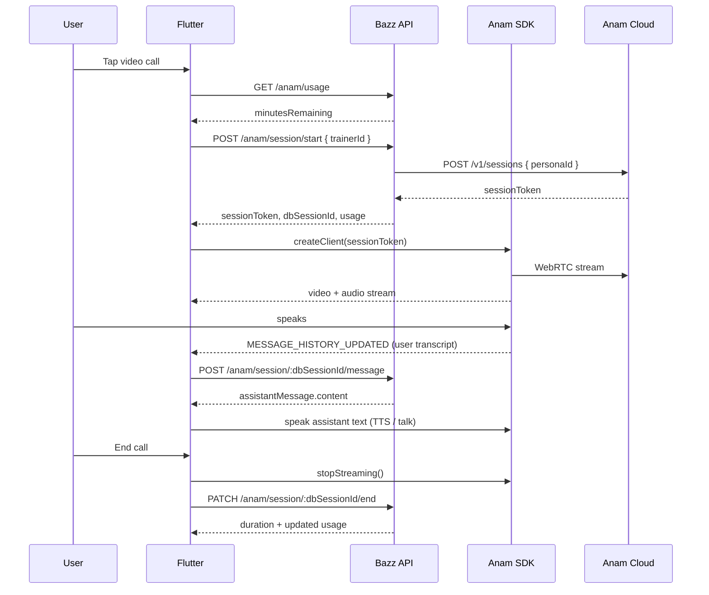

# Anam AI Video Call — Flutter Integration Guide

This document is for the **Flutter developer**. It maps our **Bazz backend** Anam endpoints to a mobile video-call flow, and translates the official Anam HTML/JS example into Flutter.

**Do not put `ANAM_API_KEY` in the Flutter app.** Our backend creates the Anam session and returns a short-lived `sessionToken`. Flutter only talks to Bazz APIs + the Anam Flutter SDK.

---

## Table of contents

1. [Architecture](#architecture)
2. [Base URL & auth](#base-url--auth)
3. [All backend endpoints](#all-backend-endpoints)
4. [Video call flow (step by step)](#video-call-flow-step-by-step)
5. [HTML example vs our backend](#html-example-vs-our-backend)
6. [Flutter setup](#flutter-setup)
7. [Dart code](#dart-code)
8. [UI checklist](#ui-checklist)
9. [Error handling](#error-handling)
10. [Testing checklist](#testing-checklist)

---

## Architecture

Our app uses a **hybrid** model (not the simple “Anam-only” HTML demo):

| Layer | Responsibility |
|--------|----------------|
| **Anam SDK (Flutter)** | WebRTC video avatar, microphone, speech events, TTS lip-sync |
| **Bazz backend** | Session lifecycle, monthly minutes, trainer persona, **custom AI brain** (memory, workouts, content library) |
| **Flutter app** | Glue: start/end session via API, forward user speech text to backend, speak backend reply through Anam |



**Important:** `POST /anam/session/:sessionId/message` is **required**. The trainer’s AI replies (with user memory, recent workouts, video titles, etc.) come from **our backend**, not from Anam’s default LLM.

Use **`dbSessionId`** from `POST /anam/session/start` in all session URLs — not `anamSessionId`.

---

## Base URL & auth

| Item | Value |
|------|--------|
| API prefix | `/api/v1` |
| Example dev base | `http://<host>:8080/api/v1` |
| Auth header | `Authorization: Bearer <user_jwt_token>` |
| User routes | JWT role must be **`user`** |
| Trainer persona routes | JWT role must be **`trainer`** |

All Anam user endpoints use `guardRole("user")` — verified users only.

---

## All backend endpoints

Implement **every** endpoint below for a complete video-call feature.

### User app — video call (required)

#### 1. Get monthly usage (show before / during call)

```
GET /api/v1/anam/usage
Authorization: Bearer <token>
```

**Response `data`:**

```json
{
  "monthlyMinutesLimit": 250,
  "minutesUsedThisMonth": 12,
  "minutesRemaining": 238,
  "periodResetDate": "2026-07-15T00:00:00.000Z",
  "totalMinutesAllTime": 45,
  "isLimitReached": false
}
```

Use this on the call screen to show “X minutes remaining” and disable the call button when `isLimitReached === true`.

---

#### 2. Start call (user taps call icon)

```
POST /api/v1/anam/session/start
Authorization: Bearer <token>
Content-Type: application/json

{ "trainerId": "<mongo_trainer_id>" }
```

**Success `201` — `data`:**

```json
{
  "dbSessionId": "674abc123...",
  "anamSessionId": "anam-session-id",
  "sessionToken": "eyJ...",
  "personaId": "demo123",
  "trainerName": "Jessica",
  "usage": {
    "minutesRemaining": 238,
    "minutesUsedThisMonth": 12,
    "monthlyMinutesLimit": 250,
    "periodResetDate": "2026-07-15T00:00:00.000Z"
  }
}
```

**Errors:**

| Status | Meaning |
|--------|---------|
| `400` | Missing `trainerId`, trainer has no Anam setup, or active session already exists |
| `403` | Monthly limit reached — body includes `"code": "MONTHLY_LIMIT_REACHED"` |

**Pre-check:** Only show the call button if trainer has `anamAI.isEnabled === true` and a non-empty `personaId` (from trainer profile API).

---

#### 3. Send message during call (user spoke — get AI reply)

```
POST /api/v1/anam/session/:dbSessionId/message
Authorization: Bearer <token>
Content-Type: application/json

{
  "trainerId": "<mongo_trainer_id>",
  "message": "Can you suggest a chest workout?"
}
```

**Success `200` — `data`:**

```json
{
  "userMessage": {
    "role": "user",
    "content": "Can you suggest a chest workout?",
    "status": "sent",
    "source": "anam_call",
    "createdAt": "2026-06-22T10:00:00.000Z"
  },
  "assistantMessage": {
    "role": "assistant",
    "content": "Let's hit incline press today...",
    "status": "sent",
    "source": "anam_call",
    "createdAt": "2026-06-22T10:00:01.000Z"
  },
  "chatId": "...",
  "suggestedContentTitles": ["Perfect Bench Press Form Guide"]
}
```

**Flutter action:** Speak `assistantMessage.content` through the Anam avatar (see [Custom LLM / backend brain](#custom-llm--backend-brain) below).

Messages are stored in the same chat thread as text chat, tagged with `source: "anam_call"`.

---

#### 4. End call

```
PATCH /api/v1/anam/session/:dbSessionId/end
Authorization: Bearer <token>
```

**Success `200` — `data`:**

```json
{
  "sessionId": "674abc123...",
  "durationSeconds": 185,
  "durationMinutes": 4,
  "endedAt": "2026-06-22T10:05:00.000Z",
  "usage": {
    "minutesUsedThisMonth": 16,
    "monthlyMinutesLimit": 250,
    "minutesRemaining": 234,
    "periodResetDate": "2026-07-15T00:00:00.000Z",
    "totalMinutesAllTime": 49
  }
}
```

**Flutter action:** Call this when the user hangs up. Also call `AnamClient.stopStreaming()`. Update the minutes UI from `usage`.

---

### User app — history (recommended)

#### 5. Call transcript history (messages from video calls only)

```
GET /api/v1/anam/call-history?trainerId=<id>&page=1&limit=20
Authorization: Bearer <token>
```

**Response `data`:**

```json
{
  "messages": [ /* only source: "anam_call" */ ],
  "totalMessages": 42,
  "hasMore": true
}
```

---

#### 6. Completed call sessions list

```
GET /api/v1/anam/sessions?trainerId=<id>&limit=10
Authorization: Bearer <token>
```

`trainerId` is optional — omit to get all trainers.

**Response `data`:** Array of completed sessions with `startedAt`, `endedAt`, `durationSeconds`, populated `trainerId` (name, specialty, profileImage, anamAI).

---

### Trainer app — persona setup (trainer side only)

These are **not** used during the user video call, but the trainer app must implement them so calls work.

#### 7. Set Anam persona ID

```
PUT /api/v1/trainer/:trainerId/anam
Authorization: Bearer <trainer_token>
Content-Type: application/json

{ "personaId": "your-anam-persona-id-from-lab" }
```

**Response `data`:**

```json
{
  "trainerId": "...",
  "personaId": "...",
  "isEnabled": true
}
```

#### 8. Remove Anam persona

```
DELETE /api/v1/trainer/:trainerId/anam
Authorization: Bearer <trainer_token>
```

---

## Video call flow (step by step)

### Before call

1. Load trainer profile → confirm `trainer.anamAI?.isEnabled == true`.
2. `GET /anam/usage` → if `isLimitReached`, show upgrade/limit message; do not start call.

### Start call

3. `POST /anam/session/start` with `{ trainerId }`.
4. Save `dbSessionId`, `sessionToken`, `personaId`, `usage`.
5. If `sessionToken` is null/empty (dev fallback), show error — cannot connect without token.
6. Create Anam client: `AnamClientFactory.createClient(sessionToken: sessionToken)`.
7. Start video stream (WebRTC renderer — see Dart code).
8. Show `usage.minutesRemaining` on call UI.

### During call

9. Listen for **`AnamEvent.messageHistoryUpdated`** (or device STT).
10. When the **latest user message** is new, `POST /anam/session/:dbSessionId/message` with transcript text.
11. Take `assistantMessage.content` and make the avatar speak it.
12. Optionally show `suggestedContentTitles` as chips (title only — no URL on calls).

### End call

13. `AnamClient.stopStreaming()`.
14. `PATCH /anam/session/:dbSessionId/end`.
15. Refresh usage display / navigate back.

### App lifecycle

- On dispose / background: end session if still active (avoid orphaned `active` sessions blocking the next call).
- Handle “You already have an active call session” by calling end first or resuming.

---

## HTML example vs our backend

Official Anam HTML demo (what **not** to copy literally):

```html
<!-- Browser calls Anam directly with API key — NEVER do this in Flutter -->
fetch("https://api.anam.ai/v1/auth/session-token", {
  headers: { Authorization: `Bearer ${API_KEY}` },
  body: JSON.stringify({ personaConfig: { name, avatarId, voiceId, llmId, systemPrompt } }),
});
const anamClient = createClient(sessionToken);
await anamClient.streamToVideoElement("persona-video");
```

**Our equivalent:**

| HTML / JS demo | Flutter + Bazz backend |
|----------------|-------------------------|
| `API_KEY` in client | ❌ Never — backend holds `ANAM_API_KEY` |
| `POST .../auth/session-token` | ✅ `POST /api/v1/anam/session/start` |
| Full `personaConfig` in client | ✅ Backend sends `{ personaId }` to Anam (`trainer.anamAI.personaId`) |
| Anam built-in LLM | ❌ Backend LLM via `/anam/session/:id/message` |
| `<video id="persona-video">` | ✅ `RTCVideoRenderer` + `AnamAvatarView` |
| `createClient(sessionToken)` | ✅ `AnamClientFactory.createClient(sessionToken: ...)` |
| `streamToVideoElement()` | ✅ `client.talk(..., onStreamReady: (stream) => ...)` |

### Custom LLM / backend brain

Anam’s [Custom LLM guide](https://anam.ai/docs/javascript-sdk/custom-llm) pattern:

1. User finishes speaking → client gets transcript (`MESSAGE_HISTORY_UPDATED`).
2. Client sends text to **your server** (our `POST .../message`).
3. Server returns assistant text.
4. Client feeds text to avatar TTS (`talk` / talk stream) **without** using Anam’s default LLM.

Our backend already implements step 2–3 with trainer context. Flutter implements 1 and 4.

> **Note:** Community package `anam_flutter_sdk` is a port of the JS SDK. If `createTalkMessageStream` is not exposed yet, coordinate with backend — we may need a small SDK upgrade or use `sendUserMessage` only after disabling Anam LLM via persona config in Anam Lab. Prefer matching the JS `talk()` / stream API when available.

---

## Flutter setup

### Dependencies (`pubspec.yaml`)

```yaml
dependencies:
  flutter:
    sdk: flutter
  http: ^1.2.0
  flutter_webrtc: ^0.12.0
  anam_flutter_sdk: ^0.1.0   # community SDK — https://pub.dev/packages/anam_flutter_sdk
  # Optional: speech_to_text if you disable Anam mic and roll your own STT
```

### iOS — `ios/Runner/Info.plist`

```xml
<key>NSMicrophoneUsageDescription</key>
<string>Microphone access is required for video calls with your AI trainer.</string>
<key>NSCameraUsageDescription</key>
<string>Camera access may be required for video calls.</string>
```

### Android — `android/app/src/main/AndroidManifest.xml`

```xml
<uses-permission android:name="android.permission.INTERNET" />
<uses-permission android:name="android.permission.RECORD_AUDIO" />
<uses-permission android:name="android.permission.MODIFY_AUDIO_SETTINGS" />
```

---

## Dart code

Replace `BASE_URL` and wire `authToken` from your existing auth layer.

### 1. API client — all Anam endpoints

```dart
// lib/services/anam_api_service.dart

import 'dart:convert';
import 'package:http/http.dart' as http;

class AnamApiService {
  AnamApiService({
    required this.baseUrl,
    required this.getAuthToken,
    http.Client? client,
  }) : _client = client ?? http.Client();

  final String baseUrl; // e.g. http://10.0.2.2:8080/api/v1
  final Future<String> Function() getAuthToken;
  final http.Client _client;

  Future<Map<String, String>> _headers() async => {
        'Content-Type': 'application/json',
        'Authorization': 'Bearer ${await getAuthToken()}',
      };

  Future<Map<String, dynamic>> getUsage() async {
    final res = await _client.get(
      Uri.parse('$baseUrl/anam/usage'),
      headers: await _headers(),
    );
    return _decode(res);
  }

  Future<AnamStartSessionData> startSession(String trainerId) async {
    final res = await _client.post(
      Uri.parse('$baseUrl/anam/session/start'),
      headers: await _headers(),
      body: jsonEncode({'trainerId': trainerId}),
    );
    final json = _decode(res);
    return AnamStartSessionData.fromJson(json['data'] as Map<String, dynamic>);
  }

  Future<AnamMessageData> sendMessage({
    required String dbSessionId,
    required String trainerId,
    required String message,
  }) async {
    final res = await _client.post(
      Uri.parse('$baseUrl/anam/session/$dbSessionId/message'),
      headers: await _headers(),
      body: jsonEncode({'trainerId': trainerId, 'message': message}),
    );
    final json = _decode(res);
    return AnamMessageData.fromJson(json['data'] as Map<String, dynamic>);
  }

  Future<AnamEndSessionData> endSession(String dbSessionId) async {
    final res = await _client.patch(
      Uri.parse('$baseUrl/anam/session/$dbSessionId/end'),
      headers: await _headers(),
    );
    final json = _decode(res);
    return AnamEndSessionData.fromJson(json['data'] as Map<String, dynamic>);
  }

  Future<AnamCallHistoryData> getCallHistory({
    required String trainerId,
    int page = 1,
    int limit = 20,
  }) async {
    final uri = Uri.parse('$baseUrl/anam/call-history').replace(
      queryParameters: {
        'trainerId': trainerId,
        'page': '$page',
        'limit': '$limit',
      },
    );
    final res = await _client.get(uri, headers: await _headers());
    final json = _decode(res);
    return AnamCallHistoryData.fromJson(json['data'] as Map<String, dynamic>);
  }

  Future<List<AnamSessionRecord>> getSessionHistory({
    String? trainerId,
    int limit = 10,
  }) async {
    final params = <String, String>{'limit': '$limit'};
    if (trainerId != null) params['trainerId'] = trainerId;

    final uri = Uri.parse('$baseUrl/anam/sessions').replace(queryParameters: params);
    final res = await _client.get(uri, headers: await _headers());
    final json = _decode(res);
    final list = json['data'] as List<dynamic>;
    return list
        .map((e) => AnamSessionRecord.fromJson(e as Map<String, dynamic>))
        .toList();
  }

  Map<String, dynamic> _decode(http.Response res) {
    final body = jsonDecode(res.body) as Map<String, dynamic>;
    if (res.statusCode >= 400 || body['success'] == false) {
      final code = body['code'] as String?;
      throw AnamApiException(
        statusCode: res.statusCode,
        message: body['message']?.toString() ?? 'Request failed',
        code: code,
      );
    }
    return body;
  }
}

class AnamApiException implements Exception {
  AnamApiException({required this.statusCode, required this.message, this.code});
  final int statusCode;
  final String message;
  final String? code;
  bool get isMonthlyLimit => code == 'MONTHLY_LIMIT_REACHED';
}

// --- Response models (minimal) ---

class AnamUsage {
  AnamUsage.fromJson(Map<String, dynamic> j)
      : monthlyMinutesLimit = j['monthlyMinutesLimit'] as int,
        minutesUsedThisMonth = j['minutesUsedThisMonth'] as int,
        minutesRemaining = j['minutesRemaining'] as int,
        isLimitReached = j['isLimitReached'] as bool? ?? false,
        periodResetDate = DateTime.parse(j['periodResetDate'] as String);

  final int monthlyMinutesLimit;
  final int minutesUsedThisMonth;
  final int minutesRemaining;
  final bool isLimitReached;
  final DateTime periodResetDate;
}

class AnamStartSessionData {
  AnamStartSessionData.fromJson(Map<String, dynamic> j)
      : dbSessionId = j['dbSessionId'] as String,
        sessionToken = j['sessionToken'] as String?,
        personaId = j['personaId'] as String,
        trainerName = j['trainerName'] as String?,
        usage = AnamUsage.fromJson(j['usage'] as Map<String, dynamic>);

  final String dbSessionId;
  final String? sessionToken;
  final String personaId;
  final String? trainerName;
  final AnamUsage usage;
}

class AnamMessageData {
  AnamMessageData.fromJson(Map<String, dynamic> j)
      : assistantText = (j['assistantMessage'] as Map)['content'] as String,
        suggestedContentTitles =
            (j['suggestedContentTitles'] as List<dynamic>? ?? []).cast<String>();

  final String assistantText;
  final List<String> suggestedContentTitles;
}

class AnamEndSessionData {
  AnamEndSessionData.fromJson(Map<String, dynamic> j)
      : durationSeconds = j['durationSeconds'] as int,
        usage = j['usage'] != null
            ? AnamUsage.fromJson(j['usage'] as Map<String, dynamic>)
            : null;

  final int durationSeconds;
  final AnamUsage? usage;
}

class AnamCallHistoryData {
  AnamCallHistoryData.fromJson(Map<String, dynamic> j)
      : messages = (j['messages'] as List<dynamic>? ?? []),
        hasMore = j['hasMore'] as bool? ?? false;

  final List<dynamic> messages;
  final bool hasMore;
}

class AnamSessionRecord {
  AnamSessionRecord.fromJson(Map<String, dynamic> j)
      : id = j['_id'] as String,
        durationSeconds = j['durationSeconds'] as int?,
        startedAt = DateTime.parse(j['startedAt'] as String);

  final String id;
  final int? durationSeconds;
  final DateTime startedAt;
}
```

### 2. Call controller — maps HTML `startChat()` to Flutter

```dart
// lib/features/anam/anam_call_controller.dart

import 'dart:async';
import 'package:anam_flutter_sdk/anam_flutter_sdk.dart';
import 'package:flutter_webrtc/flutter_webrtc.dart';
import '../services/anam_api_service.dart';

enum AnamCallStatus {
  idle,
  loadingUsage,
  starting,
  connecting,
  connected,
  ending,
  error,
}

class AnamCallController {
  AnamCallController({required AnamApiService api}) : _api = api;

  final AnamApiService _api;

  AnamClient? _client;
  RTCVideoRenderer? renderer;
  StreamSubscription? _historySub;

  String? dbSessionId;
  String? trainerId;
  AnamUsage? usage;

  AnamCallStatus status = AnamCallStatus.idle;
  String? errorMessage;
  String? lastSuggestedVideoTitle;

  Future<void> prepare(String trainerId) async {
    this.trainerId = trainerId;
    status = AnamCallStatus.loadingUsage;
    usage = AnamUsage.fromJson(
      (await _api.getUsage())['data'] as Map<String, dynamic>,
    );
    if (usage!.isLimitReached) {
      status = AnamCallStatus.error;
      errorMessage = 'Monthly minute limit reached';
    } else {
      status = AnamCallStatus.idle;
    }
  }

  /// Equivalent to HTML startChat()
  Future<void> startCall() async {
    if (trainerId == null) return;

    try {
      status = AnamCallStatus.starting;
      final session = await _api.startSession(trainerId!);
      dbSessionId = session.dbSessionId;
      usage = session.usage;

      final token = session.sessionToken;
      if (token == null || token.isEmpty) {
        throw Exception('No sessionToken from backend — Anam API may be down');
      }

      status = AnamCallStatus.connecting;

      // HTML: const anamClient = createClient(sessionToken);
      _client = AnamClientFactory.createClient(sessionToken: token);

      renderer = RTCVideoRenderer();
      await renderer!.initialize();

      // HTML: await anamClient.streamToVideoElement("persona-video");
      // Flutter SDK uses talk() + onStreamReady instead of streamToVideoElement
      await _client!.talk(
        personaConfig: PersonaConfig(
          personaId: session.personaId,
          name: session.trainerName ?? 'Trainer',
          avatarId: session.personaId, // personaId-driven session from backend
          voiceId: session.personaId,
        ),
        onStreamReady: (stream) {
          if (stream != null) renderer!.srcObject = stream;
        },
      );

      _listenForUserSpeech();

      _client!.on(AnamEvent.connectionEstablished).listen((_) {
        status = AnamCallStatus.connected;
      });

      status = AnamCallStatus.connected;
    } catch (e) {
      status = AnamCallStatus.error;
      errorMessage = e.toString();
      await _cleanupAnamOnly();
    }
  }

  /// When user finishes speaking → backend AI → avatar speaks reply
  void _listenForUserSpeech() {
    _historySub?.cancel();
    _historySub = _client!
        .on<List<Message>>(AnamEvent.messageHistoryUpdated)
        .listen((messages) async {
      if (messages.isEmpty || trainerId == null || dbSessionId == null) return;

      final last = messages.last;
      if (last.role != MessageRole.user) return;

      final userText = last.content.trim();
      if (userText.isEmpty) return;

      try {
        final reply = await _api.sendMessage(
          dbSessionId: dbSessionId!,
          trainerId: trainerId!,
          message: userText,
        );

        lastSuggestedVideoTitle = reply.suggestedContentTitles.isNotEmpty
            ? reply.suggestedContentTitles.first
            : null;

        // Speak backend reply (custom LLM pattern)
        // JS equivalent: anamClient.talk(assistantText) or createTalkMessageStream
        _client!.sendUserMessage(reply.assistantText);
      } catch (e) {
        errorMessage = e.toString();
      }
    });
  }

  Future<void> endCall() async {
    if (dbSessionId == null) return;
    status = AnamCallStatus.ending;

    try {
      await _cleanupAnamOnly();
      final result = await _api.endSession(dbSessionId!);
      usage = result.usage ?? usage;
    } finally {
      dbSessionId = null;
      status = AnamCallStatus.idle;
    }
  }

  Future<void> _cleanupAnamOnly() async {
    await _historySub?.cancel();
    _historySub = null;
    await _client?.stopStreaming();
    _client = null;
    await renderer?.dispose();
    renderer = null;
  }

  void toggleMic(bool enabled) => _client?.setInputAudioEnabled(enabled);

  void dispose() {
    endCall();
  }
}
```

### 3. Call screen UI (HTML `<video>` + status equivalent)

```dart
// lib/features/anam/anam_call_screen.dart

import 'package:anam_flutter_sdk/anam_flutter_sdk.dart';
import 'package:flutter/material.dart';
import 'package:flutter_webrtc/flutter_webrtc.dart';
import 'anam_call_controller.dart';

class AnamCallScreen extends StatefulWidget {
  const AnamCallScreen({
    super.key,
    required this.controller,
    required this.trainerName,
  });

  final AnamCallController controller;
  final String trainerName;

  @override
  State<AnamCallScreen> createState() => _AnamCallScreenState();
}

class _AnamCallScreenState extends State<AnamCallScreen> {
  bool micEnabled = true;

  @override
  void initState() {
    super.initState();
    widget.controller.startCall();
  }

  @override
  void dispose() {
    widget.controller.endCall();
    super.dispose();
  }

  String _statusText(AnamCallController c) {
    switch (c.status) {
      case AnamCallStatus.starting:
        return 'Creating session...';
      case AnamCallStatus.connecting:
        return 'Connecting...';
      case AnamCallStatus.connected:
        return 'Connected! Start speaking to ${widget.trainerName}';
      case AnamCallStatus.ending:
        return 'Ending call...';
      case AnamCallStatus.error:
        return c.errorMessage ?? 'Failed to connect';
      default:
        return 'Loading...';
    }
  }

  @override
  Widget build(BuildContext context) {
    final c = widget.controller;
    final usage = c.usage;

    return Scaffold(
      appBar: AppBar(
        title: Text('Call ${widget.trainerName}'),
        actions: [
          if (usage != null)
            Padding(
              padding: const EdgeInsets.only(right: 12),
              child: Center(
                child: Text('${usage.minutesRemaining} min left'),
              ),
            ),
        ],
      ),
      body: Column(
        children: [
          Expanded(
            child: c.renderer != null
                ? AnamAvatarView(
                    renderer: c.renderer!,
                    isMicEnabled: micEnabled,
                    showControls: false,
                    borderRadius: 8,
                    backgroundColor: Colors.black,
                  )
                : const Center(child: CircularProgressIndicator()),
          ),
          Padding(
            padding: const EdgeInsets.all(16),
            child: Text(
              _statusText(c),
              style: TextStyle(color: Colors.grey[600], fontSize: 14),
              textAlign: TextAlign.center,
            ),
          ),
          if (c.lastSuggestedVideoTitle != null)
            Padding(
              padding: const EdgeInsets.symmetric(horizontal: 16),
              child: Chip(
                label: Text('Suggested: ${c.lastSuggestedVideoTitle}'),
              ),
            ),
          Row(
            mainAxisAlignment: MainAxisAlignment.spaceEvenly,
            children: [
              IconButton(
                icon: Icon(micEnabled ? Icons.mic : Icons.mic_off),
                onPressed: () {
                  setState(() {
                    micEnabled = !micEnabled;
                    c.toggleMic(micEnabled);
                  });
                },
              ),
              FloatingActionButton(
                backgroundColor: Colors.red,
                onPressed: () => Navigator.of(context).pop(),
                child: const Icon(Icons.call_end),
              ),
            ],
          ),
          const SizedBox(height: 24),
        ],
      ),
    );
  }
}
```

### 4. Trainer app — set persona (one-time setup)

```dart
Future<void> saveTrainerPersona({
  required String baseUrl,
  required String trainerToken,
  required String trainerId,
  required String personaId,
}) async {
  final res = await http.put(
    Uri.parse('$baseUrl/trainer/$trainerId/anam'),
    headers: {
      'Content-Type': 'application/json',
      'Authorization': 'Bearer $trainerToken',
    },
    body: jsonEncode({'personaId': personaId}),
  );
  if (res.statusCode >= 400) {
    throw Exception('Failed to save persona: ${res.body}');
  }
}
```

---

## UI checklist

| Screen | API(s) | Notes |
|--------|--------|-------|
| Trainer chat header | `GET /anam/usage` | Show minutes badge |
| Call button visibility | Trainer profile `anamAI.isEnabled` | Hide if not configured |
| Active call | `POST /session/start`, Anam SDK | Video + mic |
| In-call | `POST /session/:id/message` | On each user utterance |
| Hang up | `PATCH /session/:id/end`, `stopStreaming()` | Update usage |
| Call history tab | `GET /call-history` | `source: anam_call` messages |
| Past calls list | `GET /sessions` | Duration, date, trainer |
| Trainer settings | `PUT /trainer/:id/anam` | Persona ID from [Anam Lab](https://lab.anam.ai/) |

---

## Error handling

| Case | HTTP | Flutter action |
|------|------|----------------|
| Not logged in | `401` | Redirect to login |
| Token expired | `498` | Refresh token / re-login |
| Monthly limit | `403` + `MONTHLY_LIMIT_REACHED` | Block call, show reset date from prior `usage` |
| Trainer no Anam | `400` | Hide call button; show “Video call not available” |
| Active session exists | `400` | Call `end` on stale session or prompt user |
| Missing `sessionToken` | — | Show retry; backend Anam API may be misconfigured |
| Mic permission denied | — | Show settings prompt |

---

## Testing checklist

- [ ] `GET /anam/usage` returns remaining minutes
- [ ] Call blocked when `isLimitReached`
- [ ] `POST /anam/session/start` returns `sessionToken` + `dbSessionId`
- [ ] Video avatar appears after SDK connect
- [ ] User speech triggers `POST .../message` and avatar speaks backend reply
- [ ] `PATCH .../end` updates minutes used
- [ ] `GET /anam/call-history` shows call messages only
- [ ] `GET /anam/sessions` lists completed calls
- [ ] Trainer `PUT /trainer/:id/anam` enables call for users
- [ ] Second call works after first call ended (no stuck `active` session)

---

## Questions for backend team

If anything fails during integration, confirm with backend:

1. Is `ANAM_API_KEY` set in server `.env`?
2. Does the trainer have a valid `personaId` in Anam Lab (built-in trainers use `demo123`)?
3. Should Anam persona use **Custom LLM** mode in Lab so `sendUserMessage` does not double-run Anam’s LLM?

---

*Generated from Bazz backend modules: `src/modules/anam/*`, `src/modules/trainer/trainer.route.ts` (Anam persona routes).*
